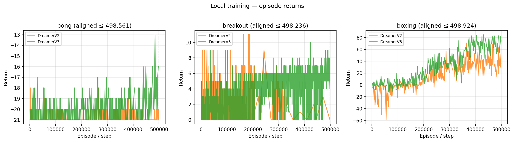
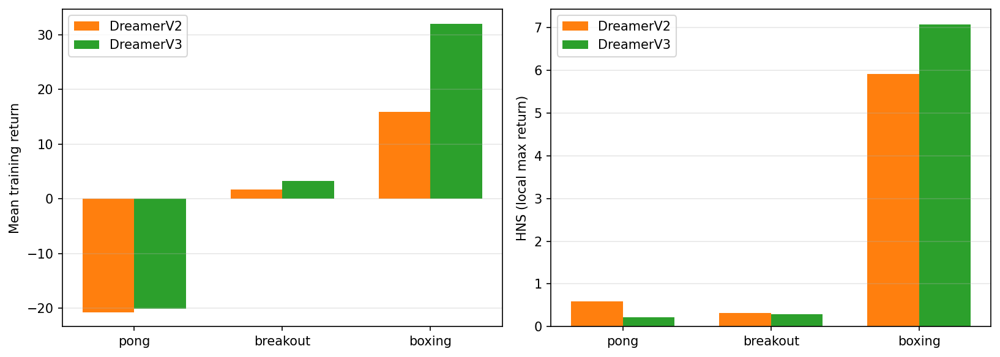

# Atari 3-Game Compare — DreamerV2 vs DreamerV3
Generated: 2026-06-13 20:36:03

## Setup
- Games: pong, breakout, boxing
- Equal wall-clock training per model (90 min default)
- GPU1 shared with ongoing Minecraft training

## Training summary

| Game | Model | Mean return | Max return | Episodes |
|------|-------|------------:|-----------:|---------:|
| pong | DreamerV2 | -20.71 | -18.00 | 613 |
| pong | DreamerV3 | -20.04 | -13.00 | 471 |
| breakout | DreamerV2 | 1.73 | 11.00 | 960 |
| breakout | DreamerV3 | 3.32 | 10.00 | 2020 |
| boxing | DreamerV2 | 15.94 | 71.00 | 279 |
| boxing | DreamerV3 | 32.04 | 85.00 | 290 |

## Alignment basis (fair cutoff)

- Metric curves and summary above are truncated to each game's `aligned_env_steps = min(v2, v3)`.
- `fair_gif = False` means current V3 main checkpoint is beyond aligned cutoff (GIF may be less fair).

| Game | V2 env steps | V2 episodes | V3 env steps | V3 episodes | Aligned env steps | Aligned episodes | fair_gif |
|------|-------------:|------------:|-------------:|------------:|------------------:|-----------------:|:--------:|
| pong | 503224 | 619 | 498561 | 471 | 498561 | 471 | ✅ |
| breakout | 498236 | 960 | 499883 | 2025 | 498236 | 960 | ✅ |
| boxing | 502097 | 281 | 498924 | 290 | 498924 | 281 | ✅ |

## Inference GIFs

Side-by-side rollouts: `highlights/inference/atari_{game}_v2v3_compare.gif`

## Anim perturbations

| Preset | repeat | sticky | Effect |
|--------|--------|--------|--------|
| baseline | 4 | 0.25 | Training-matched dynamics |
| fast | 2 | 0.25 | Faster game speed (frame skip) |
| sluggish | 4 | 0.50 | Higher action stickiness / control lag |

## Analysis

- **pong**: V3 mean return − V2 = +0.67
- **breakout**: V3 mean return − V2 = +1.59
- **boxing**: V3 mean return − V2 = +16.10

## Plots

